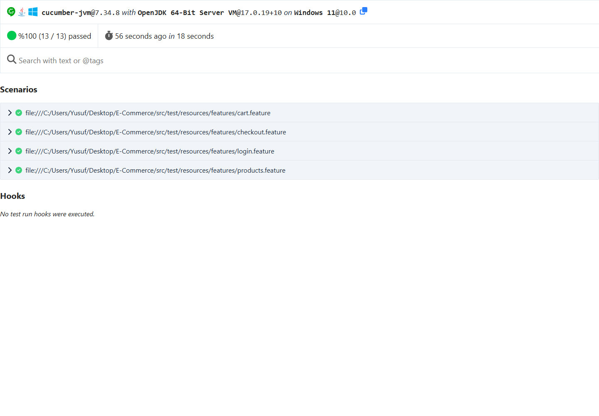
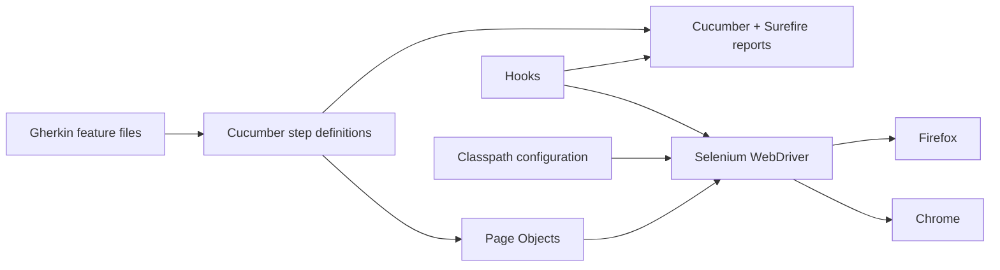

# SauceDemo Test Automation

BDD-style UI test automation for the [SauceDemo](https://www.saucedemo.com/) e-commerce demo. The suite validates critical customer journeys across Chrome and Firefox with reproducible CI evidence, failure screenshots, and maintainable Page Objects.

[](https://github.com/ykart897/saucedemo-test-automation/actions/workflows/main.yml)




## Why this project matters

A UI test suite is useful only when failures are trustworthy and reproducible. This project demonstrates more than happy-path browser scripts:

- Cross-browser execution on Chrome and Firefox through a GitHub Actions matrix.
- Explicit waits and centralized browser lifecycle management to reduce flaky behavior.
- Reliable React input synchronization in headless browser environments.
- Failure screenshots embedded directly into Cucumber reports.
- Traceability from documented requirements to executable Gherkin scenarios.
- Downloadable HTML, JSON, and Surefire reports for every CI run.

## Quality snapshot

| Signal | Result |
| --- | --- |
| Automated scenarios | 13 |
| Functional areas | Login, catalog, sorting, cart, checkout |
| Local verification | Two consecutive Chrome regression runs passed |
| CI verification | Chrome and Firefox passed |
| Latest result | 13 passed, 0 failed, 0 skipped per browser |
| Failure evidence | Screenshot attached to failed Cucumber scenarios |

## Test architecture



The feature files describe user behavior, step definitions express assertions, and Page Objects own browser interaction details. Hooks capture failure evidence and guarantee driver cleanup.

## Test coverage

| Area | Representative checks |
| --- | --- |
| Authentication | Valid login, wrong password, empty username |
| Product catalog | Inventory visibility and minimum product count |
| Sorting | Price ascending, price descending, name A–Z |
| Shopping cart | Add item, badge count, cart visibility, removal |
| Checkout | Successful order, required first name, required postal code |

SauceDemo does not provide product search, order history, or real payment processing, so those areas are intentionally outside the scope.

## Technology

| Area | Stack |
| --- | --- |
| Language and build | Java 17, Maven |
| Browser automation | Selenium WebDriver 4.49, WebDriverManager |
| BDD and assertions | Cucumber 7, TestNG |
| Design | Page Object Model, explicit waits, centralized driver lifecycle |
| Delivery | GitHub Actions, Chrome/Firefox matrix, downloadable artifacts |

## Run locally

Prerequisites: Java 17, Maven 3.9+, Chrome or Firefox, and internet access to SauceDemo and Maven Central.

```bash
mvn clean test -Dheadless=true -Dbrowser=chrome
```

Run the Firefox suite with:

```bash
mvn clean test -Dheadless=true -Dbrowser=firefox
```

Omit `-Dheadless=true` to watch the browser. If Firefox is installed in a non-standard location, add `-Dfirefox.binary="C:\path\to\firefox.exe"`.

## Reports and CI evidence

Each run creates:

- `target/cucumber-reports/cucumber.html`
- `target/cucumber-reports/cucumber.json`
- `target/surefire-reports/`

GitHub Actions retains separate `test-reports-chrome` and `test-reports-firefox` artifacts for 14 days. The latest cross-browser run is available from the [Actions page](https://github.com/ykart897/saucedemo-test-automation/actions/workflows/main.yml).

## Project structure

```text
src/test/java
├── hooks
├── pages
├── runners
├── stepdefinitions
└── utilities
src/test/resources
├── features
└── config.properties
docs
├── assets
└── test documentation
```

The Gherkin scenarios remain in Turkish to preserve the original course deliverable. Developer documentation is written in English for portfolio review.

## Documentation

- [Test plan](docs/TEST_PLAN.md)
- [Defect report](docs/DEFECT_REPORT.md)
- [Test summary](docs/TEST_SUMMARY_REPORT.md)
- [Requirements traceability matrix](docs/TRACEABILITY_MATRIX.md)

## Project status

The suite is portfolio-ready and currently passes on Chrome and Firefox in CI. No product features were added beyond SauceDemo's available flows; the work focuses on reliable automation, transparent scope, and reviewable evidence.
